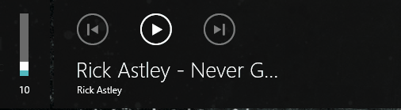
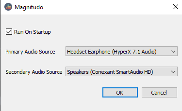

<h1 align="center">
  
  <br>
  Magnitudo
</h1>




Magnitudo is a small python script made because not all keyboard were born the same. Unfortunately some keyboards come
with prebuilt media controls on them and some doesn't. This project aims to provide a simple solution to the unlucky
few who doesn't have media controls on their keyboards.

Install
---------------
Download the latest release from [here](https://github.com/Flodur871/Magnitudo/releases/tag/v0.1)

### Build from source
```
git clone --depth 1 https://github.com/Flodur871/Magnitudo
cd Magnitudo
pip install -r requirements.txt
python Magnitudo\magnitudo.pyw
```

Usage
---------------

<table>
        <thead>
        <tr>
            <th>Command</th>
            <th>Keybind</th>
        </tr>
    </thead>
    <tbody>
        <tr>
            <th>Play/pause</th>
            <td><kbd>Ctrl</kbd> + <kbd>Space</kbd></td>
        </tr>
        <tr>
            <th>Next</th>
            <td><kbd>Ctrl</kbd> + <kbd>→</kbd></td>
        </tr>
        <tr>
            <th>Previous</th>
            <td><kbd>Ctrl</kbd> + <kbd>←</kbd></td>
        </tr>
        <tr>
            <th>Volume up</th>
            <td><kbd>Ctrl</kbd> + <kbd>↑</kbd></td>
        </tr>
        <tr>
            <th>Volume down</th>
            <td><kbd>Ctrl</kbd> + <kbd>↓</kbd></td>
        </tr>
        <tr>
            <th>Mute</th>
            <td><kbd>Ctrl</kbd> + <kbd>M</kbd></td>
        </tr>
        <tr>
            <th>Primary Audio Source</th>
            <td><kbd>Ctrl</kbd> + <kbd>Shift</kbd> + <kbd>↑</kbd></td>
        </tr>
        <tr>
            <th>Secondary Audio Source</th>
            <td><kbd>Ctrl</kbd> + <kbd>Shift</kbd> + <kbd>↓</kbd></td>
        </tr>
        <tr>
            <th>Disable/Enable</th>
            <td><kbd>Caps Lock</kbd></td>
        </tr>
    </tbody>
</table>
